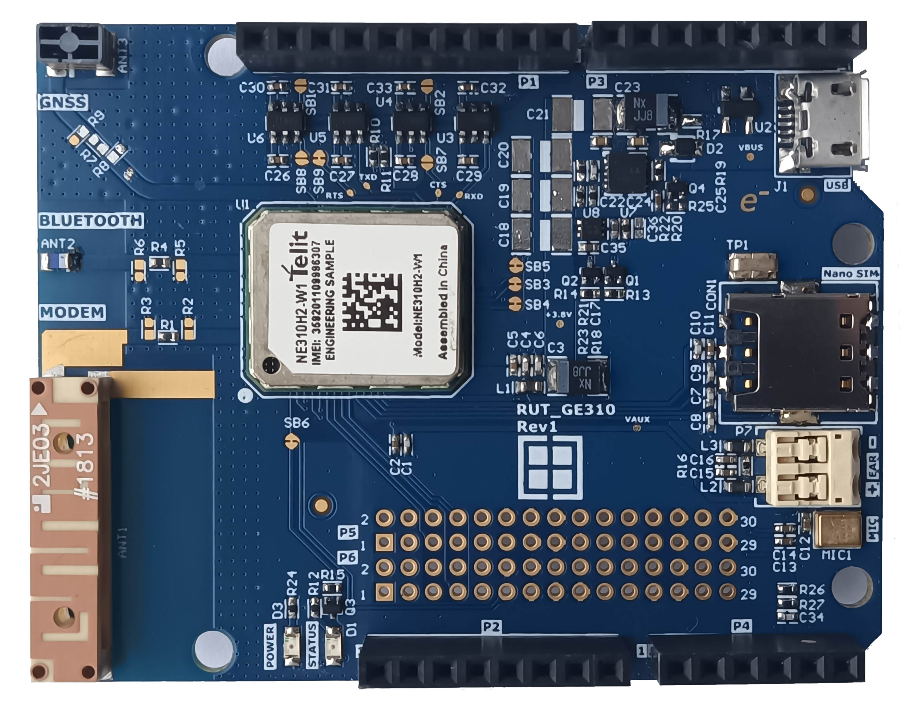

# RUT_GE310 Arduino Shield

This is the Arduino Shield for the Telit 2G quad-band modem GE310-GNSS with Bluetooth and GNSS capabilities.

## Features

-   Telit GE310-GNSS Cellular Modem (NE310H2-W1 optional).
-   2JE03 – Cellular Antenna from 2J.
-   ANT2012LL00R2400A – 2.4GHz Bluetooth/Wi-Fi Antenna from Yegeo.
-   Molex 146235-0001 1.561 –1.602 GHZ GNSS_antenna.
-   Nano SIM card slot.
-   PUI Audio PMM-3738-VM1000-R Piezoelectric MEMS Microphone.
-    ISL80103IRAJZ - High Performance  3A Linear Regulator.
-   ISL9021AIRUNZ – 3.3V 250mA Single LDO.

## Legal Disclaimer

The evaluation board including the software is for testing purposes only and, because it has limited functions and limited resilience, is not suitable for permanent use under real conditions. If the evaluation board is nevertheless used under real conditions, this is done at one’s responsibility; any liability of Rutronik is insofar excluded. 

